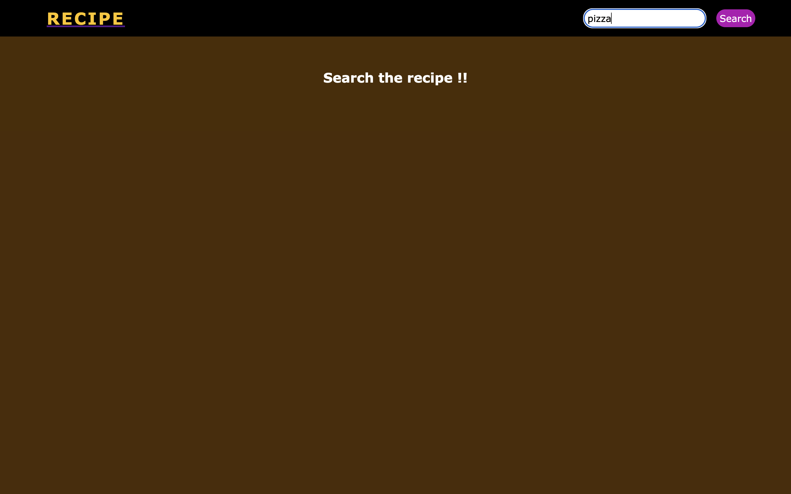
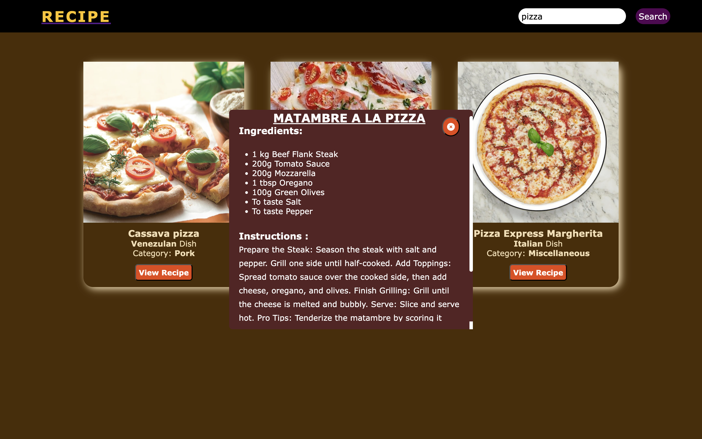

# Recipe Finder Website

A simple and clean recipe search web app built using HTML, CSS, and JavaScript.
It fetches real recipes from TheMealDB API and displays ingredients, instructions, and images instantly.

## Features
- Search any recipe by name
- Display recipe image, category, and origin
- Shows ingredients, measurements & cooking instructions 
- Pop-up modal for detailed recipe view
- Clean UI with responsive layout

## Project Structure
<pre>
Recipe/
│── index.html
│── style.css
│── script.js
│── README.md
</pre>

## Technologies Used
- HTML
- CSS
- JavaScript (DOM + Fetch API)
- Font Awesome
- TheMealDB Public API

## How It Works
1. User enters a recipe name.
2. JavaScript sends a request to TheMealDB API.
3. Recipes appear as cards.
4. Clicking **"View Recipe"** opens a popup showing:
   - Ingredients  
   - Measurements  
   - Instructions

## Live Demo (with GitHub Pages)
[click here](https://injal123.github.io/Recipe/)

## Screenshots:

